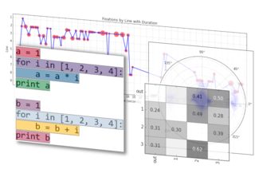

eyeCode
=======

A Python library for analyzing programmer gaze data built on top of [pandas](http://pandas.pydata.org/) and [scipy](http://www.scipy.org).
The library has the following high-level components:

* Data from real experiments
* Area of interest (AOI) creation and hit-testing
* Commonly-used fixation metrics
* Domain-specific visualizations
* Functions for automatically annotating fixations and grading responses

[<a href="http://synesthesiam.github.io/eyecode/">View Documentation</a>]
